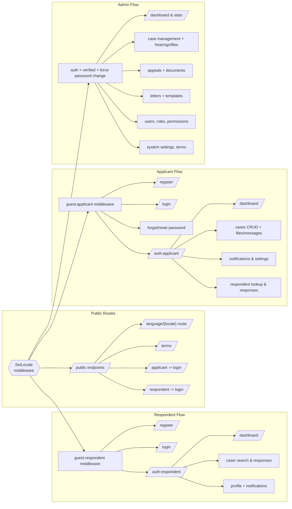

# Application workflow

```mermaid
flowchart LR
    SetLocale{{"SetLocale\nmiddleware"}}

    subgraph Public Routes
        SetLocale --> PublicLanding[/public endpoints/]
        PublicLanding --> LanguageSwitch[/"language/{locale}" route/]
        PublicLanding --> Terms[/terms/]
        PublicLanding --> ApplicantShortcut[/applicant -> login/]
        PublicLanding --> RespondentShortcut[/respondent -> login/]
    end

    subgraph Respondent Flow
        SetLocale --> RespondentGuest["guest:respondent middleware"]
        RespondentGuest --> RespondentRegister[/register/]
        RespondentGuest --> RespondentLogin[/login/]
        RespondentGuest --> RespondentAuth[/"auth:respondent"/]
        RespondentAuth --> RespondentDashboard[/dashboard/]
        RespondentAuth --> RespondentCases["caser search & responses"]
        RespondentAuth --> RespondentProfile["profile + notifications"]
    end

    subgraph Applicant Flow
        SetLocale --> ApplicantGuest["guest:applicant middleware"]
        ApplicantGuest --> ApplicantRegister[/register/]
        ApplicantGuest --> ApplicantLogin[/login/]
        ApplicantGuest --> ApplicantPassword["forgot/reset password"]
        ApplicantGuest --> ApplicantAuth[/"auth:applicant"/]
        ApplicantAuth --> ApplicantDashboard[/dashboard/]
        ApplicantAuth --> ApplicantCases["cases CRUD + files/messages"]
        ApplicantAuth --> ApplicantNotification["notifications & settings"]
        ApplicantAuth --> ApplicantRespondent["respondent lookup & responses"]
    end

    subgraph Admin Flow
        SetLocale --> AdminAuth["auth + verified + force password change"]
        AdminAuth --> AdminDashboard[/dashboard & stats/]
        AdminAuth --> AdminCases["case management + hearings/files"]
        AdminAuth --> AdminAppeals["appeals + documents"]
        AdminAuth --> AdminLetters["letters + templates"]
        AdminAuth --> AdminUsersRoles["users, roles, permissions"]
        AdminAuth --> AdminSettings["system settings, terms"]
    end
```
